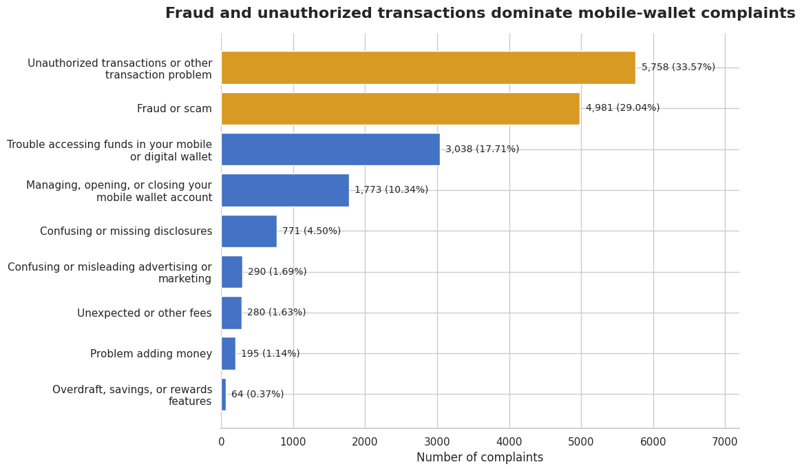
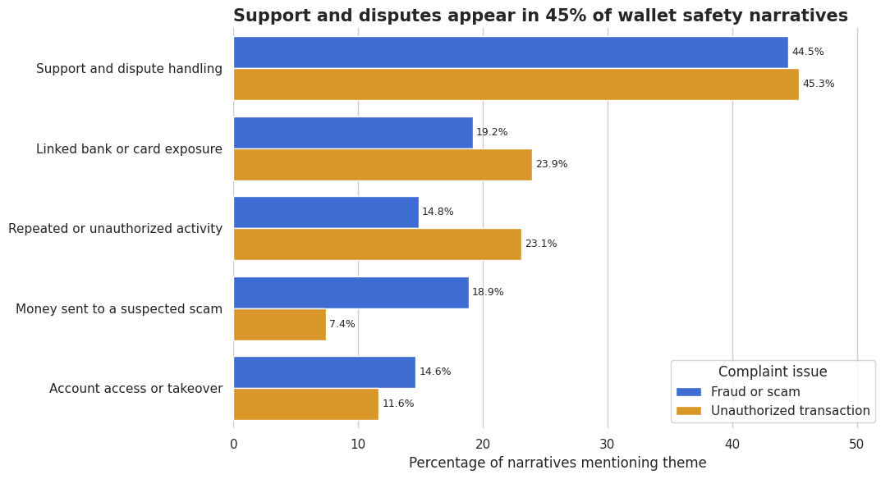
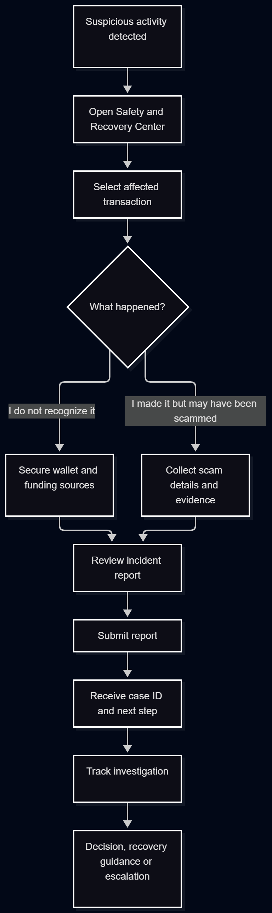

# After the Fraud Alert: Redesigning Safety and Recovery for Mobile Wallets

A data-informed product case study using **84,619 CFPB consumer complaints**, Python narrative analysis, and SQL segmentation to identify mobile-wallet safety problems and design a unified post-incident recovery experience.

[View the complete product case study in Notion](https://shy-marscapone-f25.notion.site/After-the-Fraud-Alert-Redesigning-Safety-and-Recovery-for-Mobile-Wallets-3d8d140c59518008a6f9ef4d8102fa4c)

## Project Overview

Mobile-wallet safety is not only a fraud-detection problem. After discovering suspicious activity, users must quickly secure their accounts, understand which funding sources remain exposed, report the incident, and track what happens next.

This project analyzes CFPB complaint data and proposes a **Safety and Recovery Center** that brings these actions into one guided experience.

* **Role:** Independent Product Analyst
* **Scope:** Product discovery, Python analysis, SQL segmentation, product requirements, and measurement planning
* **Dataset:** 84,619 CFPB complaints received during 2025
* **Tools:** Python, pandas, DuckDB, SQL, Google Colab, Mermaid, and Notion
* **Status:** Completed portfolio case study

## Key Findings

The analysis identified **17,150 mobile or digital-wallet complaints**.

* Unauthorized transactions accounted for **33.57%** of wallet complaints.
* Fraud or scam complaints accounted for **29.04%**.
* Together, these safety-related issues represented **62.62%** of wallet complaints.
* Adding difficulty accessing funds increased the concentration of the top three issues to **80.33%**.
* Approximately **45%** of the 6,741 published safety narratives analyzed contained support or dispute-related language.
* Monetary relief was recorded in **5.96%** of safety complaints, although CFPB response categories do not show whether consumers recovered their complete losses.



## Narrative Themes

A keyword-based analysis examined recurring themes in published fraud/scam and unauthorized-transaction narratives.

Support and dispute handling appeared in approximately 45% of both groups. Narratives also referenced linked bank or card exposure, repeated activity, suspected scams, and account-access concerns.

These themes overlap and represent the presence of relevant language rather than mutually exclusive consumer groups.



## Proposed Product Experience

The proposed **Safety and Recovery Center** would give users one place to:

1. Secure the wallet and active sessions.
2. Review and control linked funding sources.
3. Report an unauthorized transaction or scam.
4. Submit structured incident details and evidence.
5. Receive a case ID and expected next step.
6. Track the investigation and recovery process.

The experience separates unauthorized activity from payments the user authorized after deception because each situation requires different questions and protective actions.



## Product Requirements

The MVP includes:

* Multiple entry points from transaction history, alerts, and the wallet home screen
* A clear distinction between unauthorized transactions and scam transfers
* Step-up authentication before sensitive security actions
* Controls for pausing wallet activity and disabling linked funding sources
* A structured incident report with evidence upload
* Case confirmation with a unique ID and expected review period
* A case-status tracker with next steps and information requests
* A structured handoff to fraud-operations teams
* Accessible navigation, labels, focus states, and status communication
* Privacy-conscious notifications and a complete audit trail

## Success Measurement

The primary outcome is the percentage of affected users who complete the necessary protective actions and submit a sufficiently complete incident report.

Supporting measures include:

* Time to complete the first protective action
* Incident-report completion rate
* Report completeness
* Case-status self-service rate
* Repeat-contact rate
* User comprehension of case status and next steps

Guardrails include failed protective actions, duplicate cases, legitimate-payment interruptions, account-recovery abandonment, and privacy incidents.

## Repository Structure

```text
fintech-complaints-product-analysis/
├── images/
│   ├── safety_recovery_user_flow.png
│   ├── wallet_issue_distribution.png
│   └── wallet_safety_theme_comparison.png
├── notebooks/
│   ├── 01_data_validation.ipynb
│   └── 02_sql_analysis.ipynb
├── .gitignore
└── README.md
```

## Analysis Notebooks

* [Python data validation and narrative analysis](notebooks/01_data_validation.ipynb)
* [DuckDB SQL analysis](notebooks/02_sql_analysis.ipynb)

## Methodology

The project used Python and SQL to:

1. Validate and clean the 2025 CFPB complaint data.
2. Identify complaints involving mobile or digital wallets.
3. Measure the distribution of wallet complaint issues.
4. Isolate fraud/scam and unauthorized-transaction complaints.
5. Analyze available complaint narratives using predefined keyword themes.
6. Review company-response categories and monthly patterns.
7. Translate the findings into a product problem, user flow, requirements, and measurement plan.

## Limitations

* CFPB complaints represent reported experiences, not fraud rates across all wallet users.
* Only 62.77% of the selected safety complaints contained published narratives.
* Keyword matching is exploratory and may miss context, synonyms, or uncommon experiences.
* Narrative themes can overlap.
* Company-response categories do not confirm customer satisfaction or complete loss recovery.
* CFPB routing delay is not the company’s full investigation or resolution time.
* The analysis covers one calendar year.
* The proposed product has not yet been validated through user research or usability testing.

## Data Source

[CFPB Consumer Complaint Database](https://www.consumerfinance.gov/data-research/consumer-complaints/)

## Next Steps

The next phase would include interviews with affected consumers and fraud-operations staff, followed by usability testing of a clickable prototype. Testing should evaluate whether users can distinguish the two incident paths, complete protective actions under stress, understand funding-source exposure, and interpret case status and next steps.
